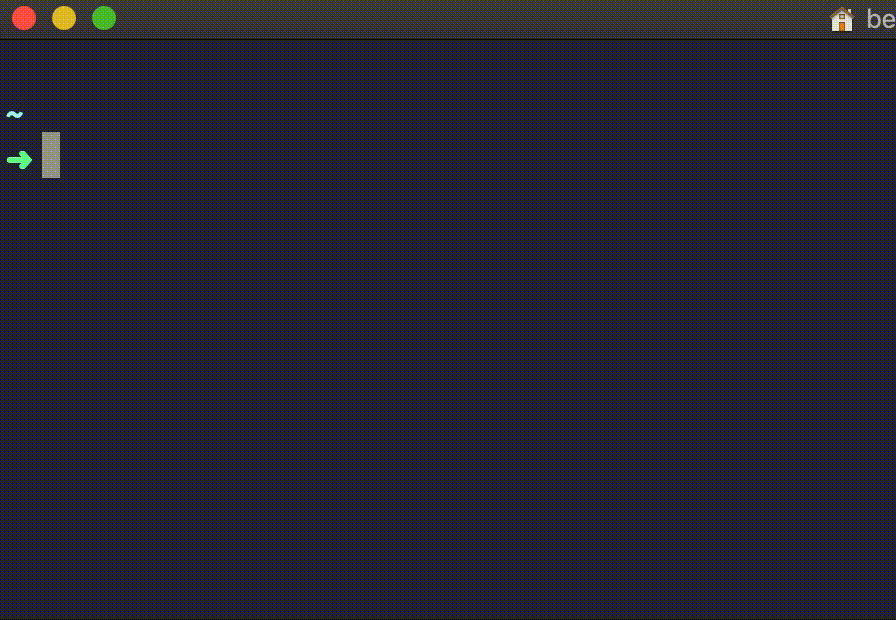

# bitcoin-converter-cli  :moneybag:
[](https://snyk.io/test/github/joaaomanooel/bitcoin-converter-cli)

***
> A CLI to convert Bitcoin to any currency provided



### Installing

```
$ npm i -g bitcoin-converter-cli
```

### How to use

```sh
bitcoin-converter-cli --help

  Usage: bitcoin-converter-cli [options]

  Convert Bitcoin to any currency defined

  Options:

    -h, --help                 output usage information
    -V, --version              output the version number
    -C, --currency <currency>  Currency to be converted. (Default: USD)
    -A, --amount <amount>      Value in Bitcoin to convert. (Default: 1)
```

### Coins Code

- USD (Business Dollar)
- USDT (Tourism Dollar)
- CAD (Canadian Dollar)
- AUD (Australian Dollar)
- EUR (Euro)
- GBP (British Pound)
- BRL (Brazilian Real)
- ARS (Argentine Peso)
- JPY (Japanese Yen)
- CHF (Swiss Franc)
- CNY (Chinese Yuan)
- YLS (Israeli New Shekel)
- BTC (Bitcoin)
- LTC (Litecoin)
- ETH (Ethereum)
- XRP (Ripple)

### Contributing

Please read [CONTRIBUTING.md](CONTRIBUTING.md) for details on our code of conduct, and the process for submitting pull requests to us.

### Versioning

We use [SemVer](http://semver.org/) for versioning. For the versions available, see the [tags on this repository](https://github.com/joaaomanooel/bitcoin-converter-cli/tags).

### Authors

| |
|:---------------------:|
|  [João Manoel Neto](https://github.com/joaaomanooel/)   |

See also the list of [contributors](https://github.com/joaaomanooel/bitcoin-converter-cli/contributors) who participated in this project.

### License

This project is licensed under the MIT License - see the [LICENSE.md](LICENSE.md) file for details
